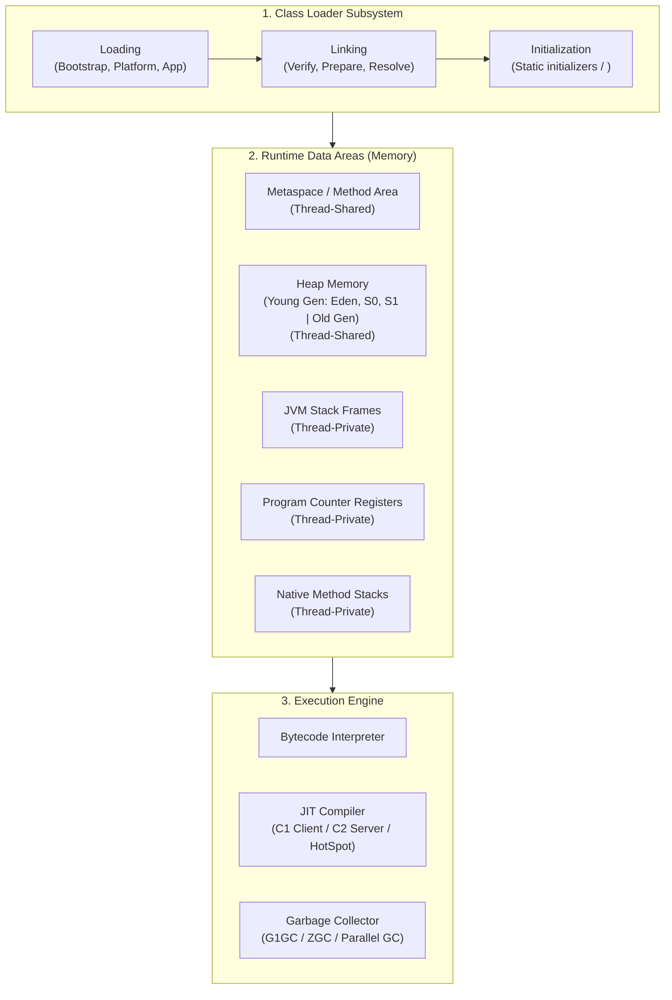
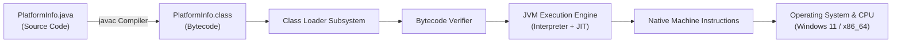
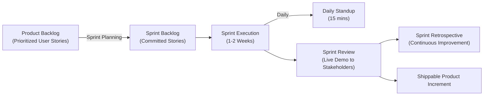

# Day 1: Java Platform Basics + Agile/Scrum Basics

**Track:** Java Platform Basics + Agile/Scrum Basics  
**Student / Engineer:** Asmitha B ([@asmitha-16](https://github.com/asmitha-16))  
**Sprint Day:** Day-01 (`day-1: java-platform-basics`)  
**Status:** Completed & Verified  

---

## 1. Executive Summary & Objectives

Day 1 establishes the foundational engineering mechanics of the Java Virtual Machine (JVM) platform ecosystem alongside modern Agile/Scrum product delivery frameworks.

### Key Deliverables Completed:
1. **JDK 21 / 25 Verification & Environment Inspection**: Compiled and executed `PlatformInfo.java` strictly using command-line tools without IDE dependencies.
2. **Bytecode Disassembly Analysis**: Inspected bytecode instructions using `javap -c PlatformInfo`.
3. **Class Loading Lifecycle Observation**: Traced runtime class loading phases via `java -verbose:class PlatformInfo`.
4. **Agile & Scrum Engineering Foundations**: Documented Sprint execution, User Story criteria (INVEST), Story Point sizing (Fibonacci scale), and Definition of Done (DoD).

---

## 2. Core Concepts: JDK vs JRE vs JVM

```
+---------------------------------------------------------------------------------+
|                       JDK (Java Development Kit)                                |
|  - Compilers: javac                                                            |
|  - Disassembler: javap                                                          |
|  - Archiver: jar                                                                |
|  - Debugger & Profilers: jdb, jconsole, jstat                                  |
|  - Documentation: javadoc                                                       |
|                                                                                 |
|  +---------------------------------------------------------------------------+  |
|  |                    JRE (Java Runtime Environment)                         |  |
|  |  - Core Class Libraries (java.base, java.sql, java.net)                   |  |
|  |  - Configuration & Security Policies                                      |  |
|  |                                                                           |  |
|  |  +---------------------------------------------------------------------+  |  |
|  |  |                 JVM (Java Virtual Machine)                          |  |  |
|  |  |  - Class Loader Subsystem (Loading, Linking, Initialization)         |  |  |
|  |  |  - Runtime Data Areas (Heap, Metaspace, Stacks, PC Registers)       |  |  |
|  |  |  - Execution Engine (Interpreter, JIT Compiler, Garbage Collector)  |  |  |
|  |  +---------------------------------------------------------------------+  |  |
|  +---------------------------------------------------------------------------+  |
+---------------------------------------------------------------------------------+
```

| Component | Nature | Primary Role | Target Audience | Key Contents |
| :--- | :--- | :--- | :--- | :--- |
| **JVM** *(Java Virtual Machine)* | Specification & Abstract Machine | Executes Java bytecode; provides hardware and OS abstraction; manages memory (GC). | Runtime Engine | Class Loader, Runtime Memory Areas, Execution Engine (Interpreter, JIT, GC). |
| **JRE** *(Java Runtime Environment)* | Software Package / Runtime Bundle | Provides the minimal environment required to execute an already compiled Java program. | End Users / Deployments | JVM + Standard Class Libraries (`java.base`, etc.) + JVM shared libraries. |
| **JDK** *(Java Development Kit)* | Complete Development Platform | Full-featured software development environment for developing, compiling, debugging, and running Java programs. | Software Developers | JRE + Development tools (`javac`, `javap`, `jar`, `javadoc`, `jdb`). |

---

## 3. JVM Deep-Dive Architecture

The JVM comprises three primary subsystems:



### 3.1 Class Loader Subsystem
Operates in three sequential phases following the **Delegation Hierarchy Principle**:
1. **Loading**: Reads binary byte stream of `.class` files into memory.
   - **Bootstrap ClassLoader**: Loads core classes from Java runtime base modules (`java.lang.*`, `java.util.*`). Written in native C/C++.
   - **Platform / Extension ClassLoader**: Loads platform modular extensions.
   - **Application / System ClassLoader**: Loads application classes found on the `CLASSPATH` or current working directory.
2. **Linking**:
   - **Verification**: Validates bytecode structural integrity, stack constraints, and security bounds to ensure it won't crash the JVM.
   - **Preparation**: Allocates memory for static fields and initializes them to language default values (e.g., `0`, `null`, `false`).
   - **Resolution**: Replaces symbolic references in the runtime constant pool with direct memory addresses.
3. **Initialization**: Executes static blocks (`static { ... }`) and assigns user-defined static values.

### 3.2 Runtime Data Areas
1. **Heap Area (Thread-Shared)**: The primary memory pool storing all object instances and arrays. Partitioned into:
   - **Young Generation**: Newly allocated objects (`Eden Space`) and surviving objects (`Survivor Spaces S0 / S1`). Cleared by Minor GC.
   - **Old (Tenured) Generation**: Long-lived objects promoted after surviving tenure thresholds. Cleared by Major/Full GC.
2. **Metaspace / Method Area (Thread-Shared)**: Stored in off-heap native memory (since Java 8), holding class definitions, method bytecode, annotations, and the runtime constant pool.
3. **JVM Stack Area (Thread-Private)**: Created per thread. Houses LIFO stack frames representing active method invocations. Each frame contains:
   - Local Variable Array (LVA)
   - Operand Stack
   - Frame Data (Reference to Constant Pool, return address)
4. **Program Counter (PC) Register (Thread-Private)**: Tracks the physical execution address of the current JVM bytecode instruction for that thread.
5. **Native Method Stack (Thread-Private)**: Manages calls made via the Java Native Interface (`JNI`) to C/C++ libraries.

### 3.3 Execution Engine
1. **Interpreter**: Parses bytecode instruction-by-instruction and executes them immediately.
2. **JIT (Just-In-Time) Compiler**: Identifies frequent execution hot spots. Compiles frequently invoked bytecode blocks directly into host CPU machine code using **C1 (Client)** and **C2 (Server)** optimization pipelines.
3. **Garbage Collector (GC)**: Performs automatic memory reclamation using generational tracing algorithms (Mark-Sweep-Compact), eliminating manual pointer deallocation and preventing memory leaks.

---

## 4. Compilation & Execution Flow



---

## 5. Hands-on Execution & Laboratory Evidence

### 5.1 Source Code: `PlatformInfo.java`
The script queries runtime parameters, host OS specifications, and JVM heap boundaries without any third-party framework or IDE:

```java
public class PlatformInfo {
    public static void main(String[] args) {
        // Query environment properties
        System.out.println("Java Version        : " + System.getProperty("java.version"));
        System.out.println("Java Vendor         : " + System.getProperty("java.vendor"));
        System.out.println("OS Name             : " + System.getProperty("os.name"));
        System.out.println("Available Processors: " + Runtime.getRuntime().availableProcessors());
        
        // Query heap metrics
        long maxMemory   = Runtime.getRuntime().maxMemory();
        long totalMemory = Runtime.getRuntime().totalMemory();
        long freeMemory  = Runtime.getRuntime().freeMemory();
        // ...
    }
}
```

### 5.2 Terminal Compilation & Execution Output
Executed from the command line:
```powershell
javac PlatformInfo.java
java PlatformInfo
```

**Verified Terminal Output:**
```text
===============================================================
             JAVA PLATFORM & RUNTIME ENVIRONMENT INFO          
===============================================================

[1] JAVA ENVIRONMENT
  - Java Version        : 25.0.1
  - Java Vendor         : Oracle Corporation
  - Java Home           : C:\Program Files\Java\jdk-25
  - JVM Name            : Java HotSpot(TM) 64-Bit Server VM
  - JVM Version         : 25.0.1+8-LTS-27

[2] OPERATING SYSTEM
  - OS Name             : Windows 11
  - OS Version          : 10.0
  - Architecture        : amd64

[3] HARDWARE CONCURRENCY
  - Available Processors: 12 logical core(s)

[4] RUNTIME HEAP MEMORY METRICS
  - Max Heap Memory     : 3.84 GB (3928.00 MB) (4118806528 bytes)
  - Total Heap Allocated: 248.00 MB (260046848 bytes)
  - Free Heap Memory    : 244.85 MB (256747872 bytes)
  - Used Heap Memory    : 3.15 MB (3298976 bytes)
===============================================================
           EXECUTION COMPLETED SUCCESSFULLY (EXIT CODE 0)      
===============================================================
```

### 5.3 Bytecode Disassembly Inspection (`javap -c PlatformInfo`)
Bytecode inspection demystifies how high-level Java code is mapped to JVM opcodes:
```text
Compiled from "PlatformInfo.java"
public class PlatformInfo {
  public PlatformInfo();
    Code:
         0: aload_0
         1: invokespecial #1                  // Method java/lang/Object."<init>":()V
         4: return

  public static void main(java.lang.String[]);
    Code:
         0: getstatic     #7                  // Field java/lang/System.out:Ljava/io/PrintStream;
         3: ldc           #13                 // String ===============================================================
         5: invokevirtual #15                 // Method java/io/PrintStream.println:(Ljava/lang/String;)V
        24: ldc           #23                 // String java.version
        26: invokestatic  #25                 // Method java/lang/System.getProperty:(Ljava/lang/String;)Ljava/lang/String;
        29: astore_1
        68: invokedynamic #39,  0             // InvokeDynamic #0:makeConcatWithConstants
       ...
}
```
**Opcode Highlights:**
- `aload_0`: Pushes `this` reference onto operand stack.
- `invokespecial`: Invokes parent constructor (`Object.<init>()`).
- `getstatic`: Fetches static reference `System.out`.
- `ldc`: Pushes constant from runtime constant pool onto stack.
- `invokevirtual`: Invokes virtual instance method `println`.
- `invokedynamic`: Implements modern Java String concatenation via `StringConcatFactory` instead of legacy `StringBuilder`.

### 5.4 Class Loading Telemetry (`java -verbose:class PlatformInfo`)
Verifying the Class Loader Subsystem in real-time:
```text
[0.016s][info][class,load] java.lang.Object source: shared objects file
[0.016s][info][class,load] java.io.Serializable source: shared objects file
[0.016s][info][class,load] java.lang.String source: shared objects file
...
[0.034s][info][class,load] PlatformInfo source: file:/C:/Users/ASMITHA/.gemini/antigravity/scratch/Campus-Lost-and-Found/Daily%20Task/Day-01/
```
**Observation:**
- Base system classes are resolved directly from JVM Class Data Sharing (`shared objects file / CDS`) for ultra-low latency initialization.
- Application class `PlatformInfo` was loaded dynamically by the Application ClassLoader from the local directory file system.

---

## 6. Agile & Scrum Basics

### 6.1 Scrum Framework Overview
Scrum is an iterative, incremental agile framework delivering software in fixed-length cadences called **Sprints** (typically 1 to 2 weeks).



### 6.2 Key Scrum Ceremonies
1. **Sprint Planning**: Team selects highest-priority backlog items, estimates effort, commits to Sprint Goal, and creates Sprint Backlog.
2. **Daily Standup (15-min timebox)**: Developers align on:
   - *What did I accomplish yesterday?*
   - *What will I work on today?*
   - *Are there any blockers / impediments in my way?*
3. **Sprint Review**: Team demonstrates completed features to stakeholders for empirical feedback.
4. **Sprint Retrospective**: Internal team inspection: *What went well? What didn't go well? Action items for next sprint.*

### 6.3 Anatomy of an Agile User Story
User stories capture product functionality from the end-user's perspective:
$$\text{“As a } \langle \text{role} \rangle, \text{ I want } \langle \text{capability} \rangle \text{ so that } \langle \text{business value} \rangle \text{.”}$$

Must satisfy the **INVEST** guidelines:
- **I**ndependent: Can be developed without tight coupling to other stories.
- **N**egotiable: Open to discussion between developers and Product Owner.
- **V**aluable: Delivers distinct value to end-users.
- **E**stimable: Well-defined enough for sizing.
- **S**mall: Sized appropriately to fit within a single sprint.
- **T**estable: Equipped with clear Acceptance Criteria.

### 6.4 Story Point Estimation & Planning Poker
Story points represent a composite measure of **effort, complexity, and uncertainty** rather than raw hours.
- Sized using modified **Fibonacci sequence**: `1, 2, 3, 5, 8, 13`.
- Small (1-2 pts): Low complexity, standard CRUD.
- Medium (3-5 pts): Business logic, multi-factor calculations, external integrations.
- Large (8 pts): High concurrency, architectural patterns, multi-service communication.
- Epics (13+ pts): Must be broken down into smaller stories.

### 6.5 Definition of Done (DoD)
A non-negotiable team agreement ensuring quality standards before any story moves to `DONE`:
1. Source code meets architectural standards and GoF design pattern guidelines.
2. 100% of functional Acceptance Criteria validated.
3. Unit and integration tests written and passing with clean assertions.
4. Code passes peer review with zero unaddressed feedback.
5. Zero critical static analysis / linter issues.
6. API documentation and `README.md` updated.
7. Deployed and verified in working test environment.
